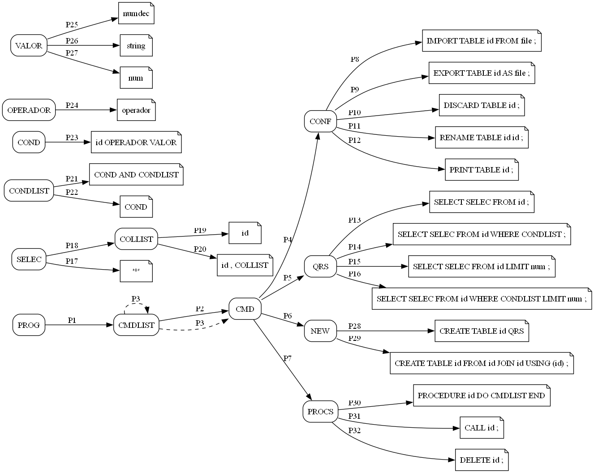

[](https://classroom.github.com/a/uCocwY5e)
Processamento de Linguagens (ESI) - laboral
-----

## trabalho prático 

### grupo  06     

| Número | Nome          |
|--------|---------------|
| 23010  | Hugo Cruz     |
| 23016  | Dani Cruz     |
| 23279  | Hugo Baptista |


### estrutura do projeto
  

  [/doc](./doc)   documentação de apoio do projeto desenvolvido / relatório do trabalho prático
  
  [/data](./data) ficheiros de dados a serem usados no programa (.csv) 

  [/input](./input) exemplos de código na linguagem CQL - Comma Query Language  (.cql)


### dependências de módulos externos 

- [`ply`](https://pypi.org/project/ply/) — **Python Lex-Yacc**


### exemplos de utilização 

```sql
IMPORT TABLE obs FROM "observacoes.csv";
PROCEDURE selecionar DO
  SELECT * FROM observacoes WHERE Temperatura > 22;
  SELECT * FROM observacoes WHERE Temperatura > 10 AND Radiacao > 100;
  SELECT * FROM observacoes LIMIT 2;
END

CREATE TABLE completo FROM est JOIN obs USING(Id);
```

#### ficheiro de entrada

```bash
python main.py ./input/exemplo01.cql 


python main.py ./input/exemplo01.cql 

```

#### de forma interativa (um comando de cada vez)

```bash
python main.py 
>> IMPORT TABLE obs FROM "observacoes.csv" ;  -- por omissão procura observacoes.csv em ./data 
>> SELECT * FROM obs;
...
```


