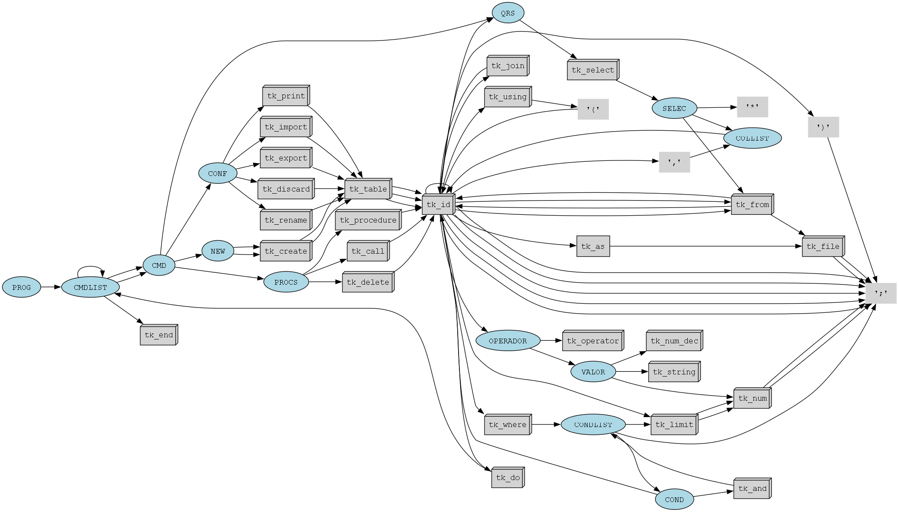

[](https://classroom.github.com/a/uCocwY5e)
Processamento de Linguagens (ESI) - laboral
-----

## Trabalho prático 

### Grupo  06     

| Número | Nome          |
|--------|---------------|
| 23010  | Hugo Cruz     |
| 23016  | Dani Cruz     |
| 23279  | Hugo Baptista |


### Estrutura do projeto
  

  [/doc](./doc)   documentação / relatório do trabalho prático
  
  [/data](./data) ficheiros de dados a serem usados no programa (.csv) 

  [/input](./input)  CQL - Comma Query Language  (.cql)


### Dependências de módulos externos 

- [`ply`](https://pypi.org/project/ply/) — **Python Lex-Yacc**


### Exemplos de utilização 

```sql
IMPORT TABLE obs FROM "observacoes.csv";
```

```sql
PROCEDURE selecionar DO
  SELECT * FROM observacoes WHERE Temperatura > 22;
  SELECT * FROM observacoes WHERE Temperatura > 10 AND Radiacao > 100;
  SELECT * FROM observacoes LIMIT 2;
END
```

```sql
CREATE TABLE completo FROM est JOIN obs USING(Id);
```

#### Ficheiro de entrada

```PYTHON
python main.py ../input/file01.cql 

python main.py ../input/file02.cql 

python main.py ../input/file03.cql 
```

#### de forma interativa (um comando de cada vez)

```bash
python main.py 
CQL >> IMPORT TABLE obs FROM "observacoes.csv" ;  
>> SELECT * FROM obs;
...
```


